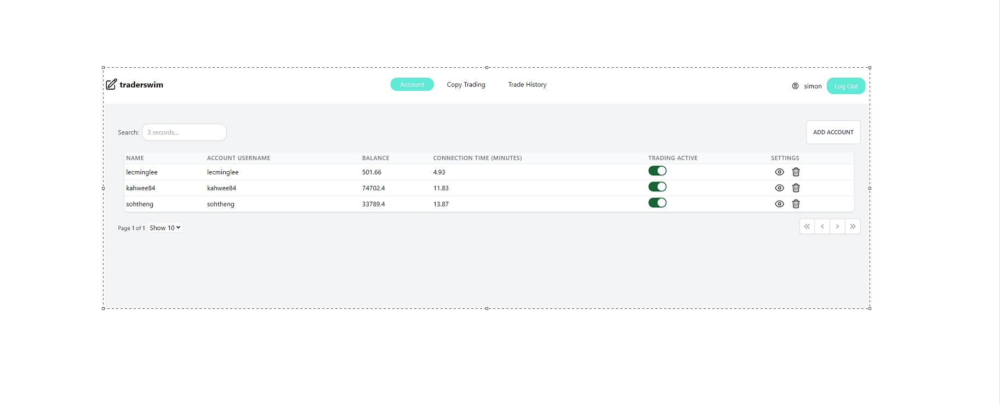
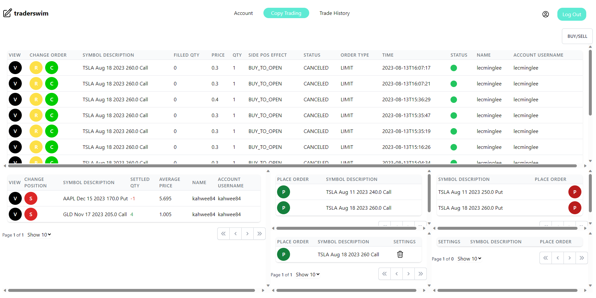
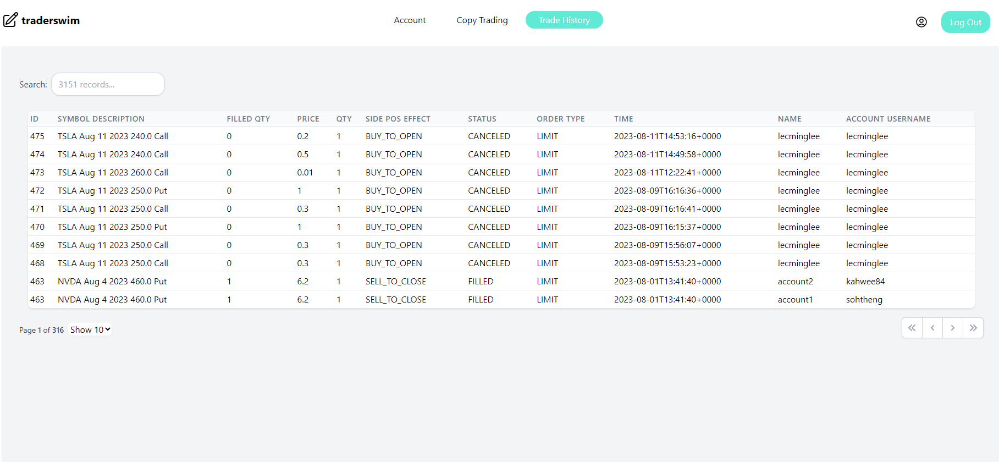

# traderswim

The primary objective of this project is to help users engage in copy trading across multiple trading accounts simultaneously on the Ameritrade trading platform. It facilitates efficient management and monitoring of all trading activities. This platform enables users to exercise control over each trade, especially during unforeseen situations.

In this web application, users can:

1. Place orders, replace orders, delete orders, and sell orders for both option trading and stock trading.
2. Monitor real-time updates on buying and selling positions.
3. Track all trading transactions of the user.

Tools:

1. Node.js
2. React
3. Memcached
4. SQLite

Next enhancements:

1. Make the software scalable to support multiple users at the same time.
2. Improve real-time live updates using WebSockets instead of database query pooling.
3. Enhance UI/UX.
4. Add security policies to allow deployment for a live website.

Video - https://www.youtube.com/watch?v=uhL5tsYlpds&t=47s

1. Handle account page
   
2. Option copy trading page
   
3. Trade history page
   
